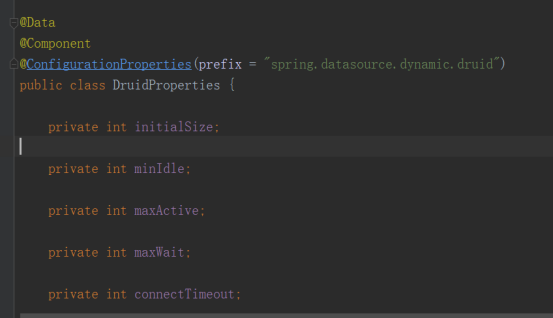

## 日志监控

该组件以拔插式、轻量级、低耦合、高扩展性的指标开发完成、记录请求和响应相关的数据<br>
该组件已经内聚了mysql、达梦数据库、elasticSearch和前端UI页面，做到添加即可使用<br>

**默认访问地址：http://项目网关地址/nginx代理地址/mxkj/index.html**

### 引入依赖

项目网关gateway项目的pom中引入以下依赖

```xml
<dependency>
    <groupId>com.mxkj</groupId>
    <artifactId>monitor-log</artifactId>
    <version>${version}</version>
</dependency>
```

::: warning
1、引入依赖后，不配置任何的数据源默认是关闭状态<br>
2、配置数据源目前可以选择mysql和elastic两种，当mysql和elastics都被配置时以elastic为主<br>
3、达梦数据库配置方式和mysql一样的、只需配置达梦驱动（ driver-class-name = dm.jdbc.driver.DmDriver）即可<br>
4、日志数据存储对应位置，数据库作为源时数据在mxkj_monitor_log表中、elastic 作为数据源时，数据在 monitors 表中
:::

### 访问权限配置

访问需要在启动网关时配置访问的账号密码<br>
session是会话有效时间，如果不配置则默认30分钟过期

```yaml
mxkj:
  auth:
    username: mxkj
    password: mxkj123..
    session: 30
```

### 数据库配置

数据库的配置主要有数据库驱动 driver 和数据库连接池 druid<br>
连接池druid的配置前缀为:**spring.datasource.dynamic.druid**



**(以上配置可以可以省略)**

::: danger
数据库的配置前缀为：**spring.datasource.dynamic.datasource.master**<br>
其中**enable=true/fales** 用于选择开启并指定数据库存储方式
:::

``` yaml
spring:
  datasource:
    dynamic:     
      datasource:
        master:
            enable: true
            driver-class-name: xxxxxxxxxxxxxxxxxxxx
            url: xxxxxxxxxxxxxxxxxxxxx
            username: xxx 
            password: xxx
```

### elastics配置

::: danger
相关配置前缀为：**spring.elasticsearch**<br>
其中**enable=true/fales** 用于选择开启并指定elastics存储方式
:::

```yaml
spring:
  elasticsearch:
    enable: false
    hostname: localhost
    port: 9200
    username: 1234
    password: 1234
```

[//]: # ([实现原理]&#40;./uploads/monitor_log.docx&#41; )