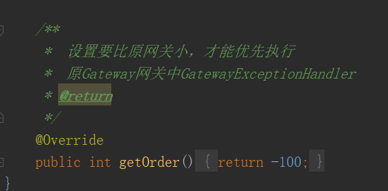

## 日志监控

该组件以拔插式、轻量级、低耦合、高扩展性的指标开发完成、记录请求和响应相关的数据<br>
该组件已经内聚了mysql、达梦数据库、elasticSearch和前端UI页面，做到添加即可使用<br>

**默认访问地址：http://项目网关地址/nginx代理地址/mxkj/index.html**

### 引入依赖

项目网关gateway项目的pom中引入以下依赖

```xml
<dependency>
    <groupId>com.mxkj</groupId>
    <artifactId>monitor-log</artifactId>
    <version>${version}</version>
</dependency>
```

::: warning
1、引入依赖后，不配置任何的数据源默认是关闭状态<br>
2、配置数据源目前可以选择mysql和elastic两种，当mysql和elastics都被配置时以elastic为主<br>
3、达梦数据库配置方式和mysql一样的、只需配置达梦驱动（ driver-class-name = dm.jdbc.driver.DmDriver）即可<br>
4、日志数据存储对应位置，数据库作为源时数据在mxkj_monitor_log表中、elastic 作为数据源时，数据在 monitors 表中
:::

### 访问权限配置

访问需要在启动网关时配置访问的账号密码<br>
session是会话有效时间，如果不配置则默认30分钟过期

```yaml
mxkj:
  auth:
    username: mxkj
    password: mxkj123..
    session: 30
```

### 数据库配置

数据库的配置主要有数据库驱动 driver 和数据库连接池 druid<br>
连接池druid的配置前缀为:**spring.datasource.dynamic.druid**


**(以上配置可以可以省略)**

::: danger
数据库的配置前缀为：**spring.datasource.dynamic.datasource.master**<br>
其中**enable=true/fales** 用于选择开启并指定数据库存储方式
:::

``` yaml
spring:
  datasource:
    dynamic:     
      datasource:
        master:
            enable: true
            driver-class-name: xxxxxxxxxxxxxxxxxxxx
            url: xxxxxxxxxxxxxxxxxxxxx
            username: xxx 
            password: xxx
```

### elastics配置

::: danger
相关配置前缀为：**spring.elasticsearch**<br>
其中**enable=true/fales** 用于选择开启并指定elastics存储方式
:::

```yaml
spring:
  elasticsearch:
    enable: false
    hostname: localhost
    port: 9200
    username: 1234
    password: 1234
```

[//]: # ([实现原理]&#40;./uploads/monitor_log.docx&#41; )

## 组件原理

日志组件主要分为三大部分，收集、储存和查询。
收集过程中除了收集各个微服务项目的请求响应结果，还包括对系统的未知请求、访问受限和非法请求，如404、401和500以上请求等。
数据捕获后，通过配置的数据库实现存储和更新等操作。为防止阻塞和造成延迟，数据捕获后采用异步方式储存数据。
数据储存后，可以通过组件内聚的UI界面实现授权登录和访问。数据查询配置会话有效期保证访问的安全性。
下面将会从源码角度解析功能的设计原理。


组件架构图

### 日志采集
##### 1.全局过滤器
日志采集是整个组件的第一步，采集目标为各种请求类型、地址、参数以及对应的正常结果或异常响应。
为了拦截全局请求，采用向Gateway网关注入高优先级的全局过滤器方式拦截进入网关的所有请求。 通过重写响应处理和注入高优先级的异常处理器ExceptionHandler捕获正常和异常响应。

全局过滤器目前优先级别默认为2000。


在该过滤器中，对于请求捕获，分为带请求体和不带请求体两种方式的请求。
在目前的版本中，仅对POST方式且数据格式为JSON的请求实现请求体的参数采集。对于其他请求暂不对请求体的参数进行采集。

在对请求体参数采集时，由于网络流式对象的不可重复读取的特性，采集时必须先读取数据并缓存到内存中，然后将数据记录同时向后续传递缓存的参数。这里通过缓存数据重新构建ServerHttpRequest对象，写入body参数，传入到后续的过滤链中。

在对响应体进行采集时，同样需要考虑该问题。同时支持对gzip编码数据块的响应支持。


#### 2.异常拦截
如果在请求过程中出现异常，如对非注册路由实现请求、未鉴权访问请求、系统异常等通过实现高优先级的ExceptionHandler实现捕获，

需要注意的是，如果优先级小于系统网关原有的其他异常处理器，该处理器的异常拦截将会失效。目前默认-100。


#### 3.异步储存
在类FilterCatchMap中，配置ThreadPoolExecuter线程池，实现日志的异步存储，防止主业务的加载阻塞或者异常。


####  日志储存

##### 1.动态装载
组件通过封装数据库支撑特性，抽象统一访问接口类DataEngine.
包含获取数据库名称、数据库初始化构建、向数据库插入数据、条件分页查询等行为方式。

其实现类目前支持Mysql和Elasticsearch。
当组件加载时，将通过配置实现数据库引擎的动态装载。动态装载的特性依赖与springboot的IOC容器管理。
首先通过springboot自动装载特性在resources/META-INF/spring/org.springframework
.boot.autoconfigure.AutoConfiguration.imports中注入需要被加载的对象。

扫描时，会扫描到config包下的MysqlConfig和ElasticSearchConfig。
该包中都存在getSqlDataEngine()方法，实现向IOC中注入DataEngine实现类。

最后，DataEngineInitializer实现了ApplicationListener<ApplicationStartedEvent>接口，在
IOC容器加载完后后，通过实现该接口的onApplicationEvent方法，完成对应数据库的初始化。


##### 2.JDBC实现
在engine.mysql包中，实现了基于JDBC通信协议的数据库操作的轻量级ORM框架，可以通过JDBC操作Mysql数据库。对应增删改查分别实现了Create、Insert、Select操作。以及下划线与小驼峰的命名映射方式等。方便基于数据对象与数据库字段的属性映射。


##### 3.扩展性预留
在该架构模式下，可以通过实现DataEngine接口，扩展更多的数据库支持。如其他DBMS规范的数据库，ORABLE、达梦、SqlServer等，组件中实现了基于JDBC的轻量级ORM框架，可以直接实现扩展。也可以支持其他非关系型数据库Redis、MangoDB等等。

#### 日志查询
1.自定义路由
Gateaway的底层依赖于Webflux，Webflux底层依赖于Netty， WebFlux是一个类似wevMvc的路由访问控制器，除了在yml文件中配置路由。组件通过配之类MonitorRouteConfiguration实现路由对象注入。对于日志查询的访问接口，在这个配置类向Gateway网关中注入几个路由对象实现外部web访问，同时配置静态资源映射，实现静态页面的资源访问。


2. 访问控制
在handler包中，实现了AuthHandler，当请求访问到mxkj/login接口，会通过配置的AuthHandler类来处理请求。该类中实现了基于账号密码的访问控制，实现了基于内存的会话有效期控制等。


3.条件分页查询
条件分页查询同理，通过在handler包中实现LogListHandler类，该类会通过DataEngin访问底层数据库，并实现封装。
